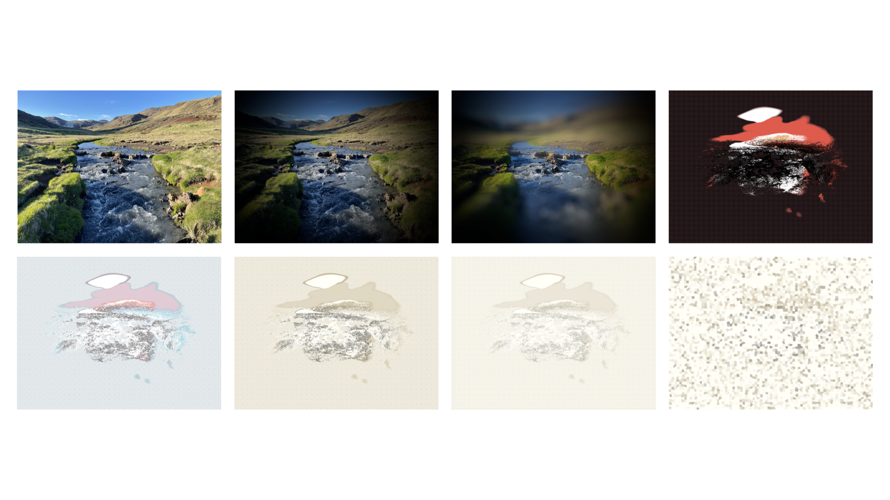
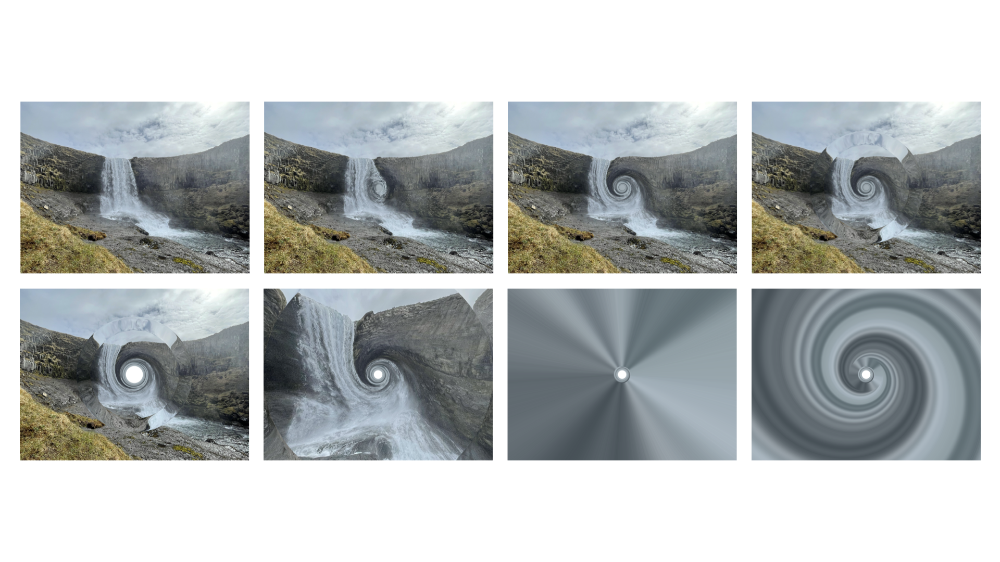
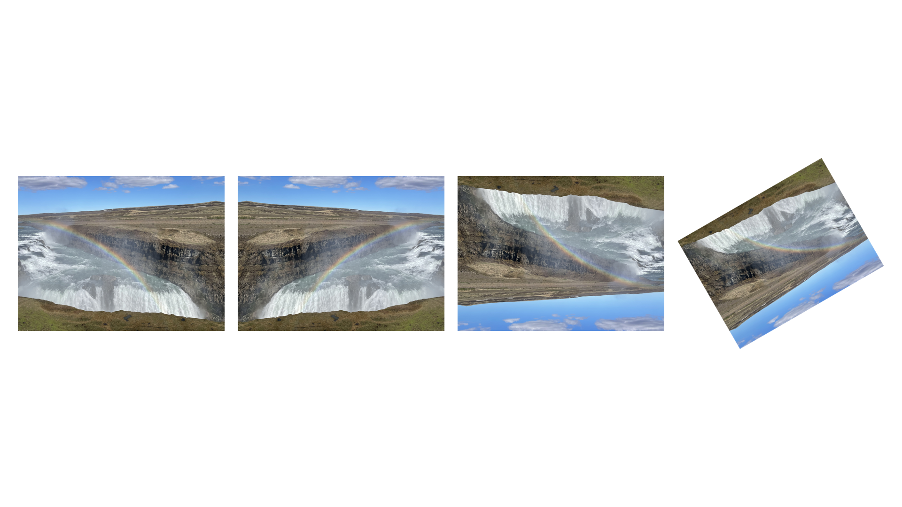

# macimg
A Python package for manipulating images using Objective-C frameworks.

# Examples

## Example 1: Applying Image Filters

```python
from macimg import Image
from macimg.filters import (
    Bloom,
    Comic,
    Crystallize,
    Edges,
    Invert,
    Sepia,
    Vignette
)

# Load an image
img = Image("assets/Iceland1.jpg")
img.show_in_preview()

# Apply a single filter
Vignette(intensity=10).apply_to(img)
img.show_in_preview()

# Apply multiple filters
filters = [Comic(), Edges(), Invert(), Sepia(), Bloom(), Crystallize(crystal_size=50)]
for index, filter in enumerate(filters):
    filter.apply_to(img)
    img.show_in_preview()
```

The code above produces the following sequence of images:


## Example 2: Applying Distortions

```python
from macimg import Image
from macimg.distortions import (
    Bump,
    CircleSplash,
    Hole,
    LightTunnel,
    Pinch,
    TorusLens,
    Vortex,
)

# Load image
img = Image("assets/Iceland2.jpg")
img.show_in_preview()

# Apply multiple distortions
distortions = [Bump(radius=500, curvature=1), Vortex(radius=750, angle=1000.0), TorusLens(radius=1000, width=250), Hole(), Pinch(intensity=1), CircleSplash(), LightTunnel()]
for index, distortion in enumerate(distortions):
    distortion.apply_to(img)
    img.show_in_preview()
```

The code above produces the following sequence of images:


## Example 3: Applying Transformations

```python
from macimg import Image
from macimg.transforms import (
    Flip,
    Rotate,
)

# Load image
img = Image("assets/Iceland3.jpg")
img.show_in_preview()

# Apply multiple transformations
transforms = [Flip("horizontal"), Flip("vertical"), Rotate(degrees=30)]
for index, transform in enumerate(transforms):
    transform.apply_to(img)
    img.show_in_preview()
```

The code above produces the following sequence of images:
