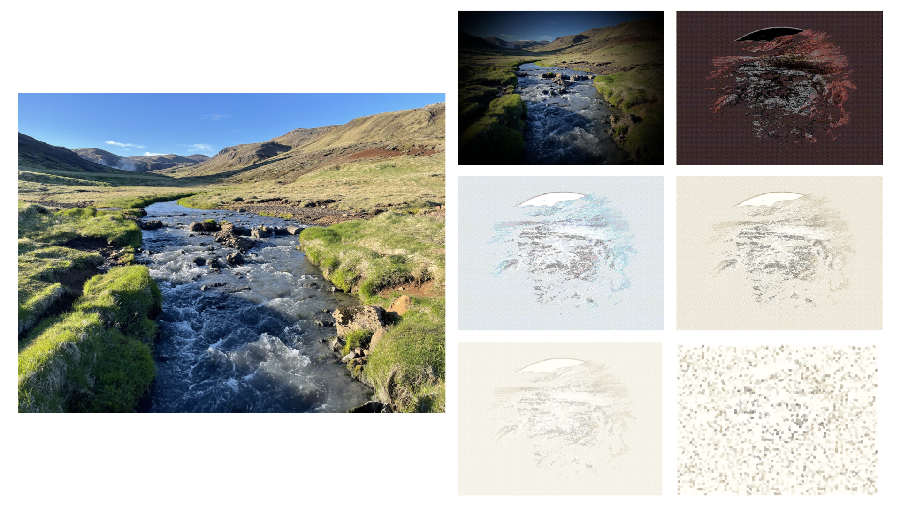

# macimg
A Python package for manipulating images using Objective-C frameworks.

# Examples

### Example 1: Applying Image Filters

```python
from macimg import Image
from macimg.filters import (
    Bloom,
    Comic,
    Crystallize,
    Edges,
    Invert,
    Sepia,
    Vignette
)

# Load an image
img = Image("assets/Iceland1.jpg")
img.show_in_preview()

# Apply a single filter
Vignette(intensity=10).apply_to(img)
img.show_in_preview()

# Apply multiple filters
filters = [Comic(), Edges(), Invert(), Sepia(), Bloom(), Crystallize(crystal_size=50)]
for index, filter in enumerate(filters):
    filter.apply_to(img)
    img.show_in_preview()
```

The code above produces the following sequence of images:
